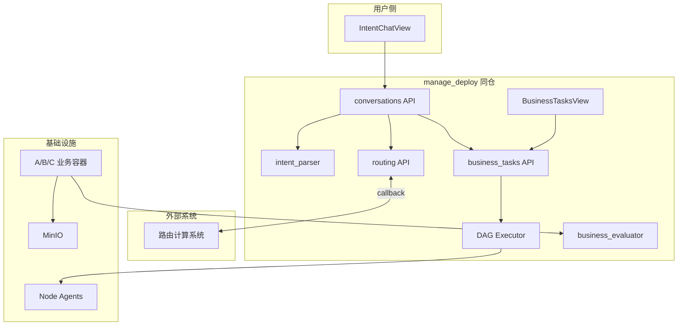
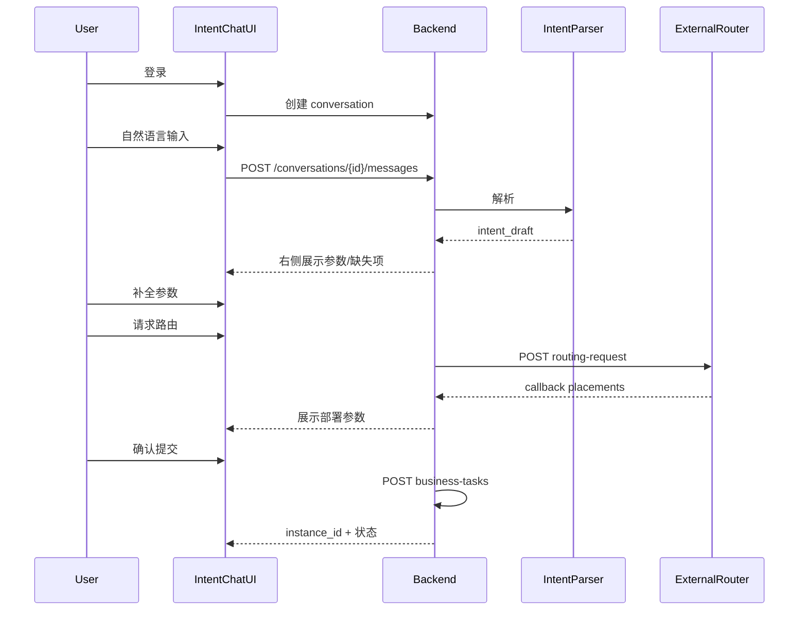

# manage_deploy 分阶段开发计划

> 本文档记录同仓开发的完整路线图，供后续逐步实施。  
> 业务契约与 JSON 格式见 [business-task-design-summary.md](./business-task-design-summary.md)。  
> 最后更新：2026-05-24

---

## 1. 架构决策

**结论：意图对话系统与部署系统同仓开发。**

| 组件 | 形态 | 说明 |
|------|------|------|
| 后端 | 单一 FastAPI 应用 | `conversations` / `routing` / `business_tasks` 分模块 |
| 前端 | 单一 Vue3 项目 | 按 role 分流：`user` → 对话，`admin` → 管理 |
| 数据库 | 同一 SQLite/MySQL | 对话、草稿、路由、部署订单同库 |
| 意图解析 | 同进程服务（先 mock） | `backend/services/intent_parser.py`，后续可拆微服务 |
| 外部路由 | 独立系统 | 异步回调写入 `placements`，本系统不自行决定节点 |

**不在现阶段拆独立前端仓库**，除非多团队长期并行且发布节奏差异大。

---

## 2. 系统边界



| 模块 | 负责 | 不负责 |
|------|------|--------|
| IntentChat + intent_parser | NL 解析、参数补全、草稿状态、拒绝不合理目标 | 节点放置 |
| ExternalRouter | A/B/C placements、策略、资源估算 | 容器启停 |
| business_tasks + DAG | 物化实例、部署、指标收集、业务成功判定 | NL 理解 |

---

## 3. 用户流程（目标态）



**状态流转：**

```text
drafting
  → awaiting_routing（意图 valid，已请求路由）
  → ready_to_submit（路由完成）
  → submitted（已调 business-tasks）
  → rejected / failed（解析拒绝或路由/部署失败）
```

---

## 4. 分阶段路线图

按模块边界顺序开发，**一个 PR 只做一层**。

### P0 工程基线

- [x] 初始化 Git 仓库
- [x] 添加根目录 `.gitignore`
- [ ] 首次 commit（按模块拆分 3~4 个 commit）
- [x] 更新 AGENTS.md、CLAUDE.md、README、DEVELOPMENT_ACCEPTANCE
- [x] 补充 `backend/.env.example`（SERVICE_API_TOKEN、AUTH_SECRET、MINIO_*）
- [x] 新增 `backend/tests/test_business_tasks_api.py`（L1 集成测试）
- [x] pytest 全绿（36 passed，含 register / task_id / workflow）

**验收：** Git 可用；文档与代码一致；L1 测试通过。

---

### P1 部署系统收敛（当前重点）

**目标：** 模板/实例 宏与命名端口、IPv6 PEER、实例详情与编辑、批量任务与业务订单衔接可验收。

| 项 | 状态 | 说明 |
|----|------|------|
| 模板 `macro_defs` / `port_defs` | 已实现 | API + 前端模板详情页 |
| 实例 `macro_values` / `port_values` | 已实现 | 创建 时必须填运行参数 |
| `business_ipv6` + PEER URL | 已实现 | 需 `verify_macro_port_e2e.py` 脚本验收 |
| 模板名称去重 | 已实现 | API 409 |
| 实例详情抽屉 编辑 | 已实现 | InstanceDetailView |
| seed 含 macro/port | 待做 | 更新 `seed_demo_data.py` |
| L2 `e2e_business_task.sh` | 待做 | 手工 + 脚本 |
| 批量任务 ↔ 待部署任务 | 部分 | `task_orders` + conversations 已有关联字段 |

**验收：**
- `cd backend && ./venv/bin/python -m pytest tests/ -q`
- `python scripts/verify_macro_port_e2e.py`（需本机 alpine + agent）
- 手工：模板 创建实例 → preflight → start → 检查 compute 容器 env

---

### P1b 部署接入（业务任务基础）

- [x] `backend/scripts/seed_demo_data.py`
- [x] `scripts/e2e_business_task.sh`
- [x] `POST /api/business-tasks` 可物化 instance（L1）
- [ ] L2 手工验收写入 DEVELOPMENT_ACCEPTANCE §11

---

### P2 业务容器（后续）

- [x] matmul 三节点 Worker（`workers/high-throughput-matmul/`，替代早期 A/B/C mock 规划）
  - **当前为 `/scratch` 文件 IPC，节点间无网络通信、未声明 `ports`，不符合节点间网络通信设计原则，见 P2+**
- [x] 容器上报 metric 到 `POST /api/instances/{id}/metrics`
- [x] 触发 `BusinessObjectiveEvaluation` 入库
- [x] `GET /api/business-tasks/summary` 按工单 + 已评估成功率

**验收：** metric 上报 → business_success 判定 → summary 统计（`scripts/e2e_matmul_live.sh`）。

---

### P2+ 业务节点网络通信改造（强约束补齐）

**设计原则（强约束）：**

- 业务节点之间数据**必须通过网络通信**（host 网络模式 + IPv6/IPv4 PEER URL），不允许通过共享卷（`/scratch` bind mount、NFS）、宿主机文件、对象存储中转等方式传递**业务数据**（MinIO 仅用于 C Sink 归档结果文件）。
- 每个业务节点**必须如实声明 `ports`**（监听端口），让 [`backend/api/instances.py`](../backend/api/instances.py) 的 preflight 与 [`node_agent/port_utils.py`](../node_agent/port_utils.py) 的端口占用检测覆盖到，防止同机重复部署或与其他业务发生端口冲突。
- 平台通过模板 `port_defs` + 实例 `port_values` + 路由 placements 生成 PEER URL 宏（如 `PEER_SOURCE_URL_*`、`PEER_COMPUTE_URL_*`），注入下游容器环境变量。
- 详细原则见 [`docs/business-task-design-summary.md`](business-task-design-summary.md) §4.4。

**当前偏差：** `high_throughput_matmul` 三节点全部走 `/scratch` 共享卷做文件 IPC，模板未声明 `ports`，preflight 在 matmul 上完全不生效，仅能在单机演示（三节点必须落在同一台 Worker）。

**matmul 重构子项：**

- [ ] source / compute / sink 各自开 HTTP（或 gRPC）listen，分配各自端口（如 8801 / 8802 / 8803）
  - source 提供 `GET /job` 返回 job.json；compute 拉取后计算
  - compute 提供 `GET /result` 返回 result.json；sink 拉取后上报
- [ ] [`backend/scripts/seed_demo_data.py`](../backend/scripts/seed_demo_data.py) matmul 模板节点补 `ports` 字段与 `port_defs`
- [ ] 通过模板 `port_defs` + 实例 `port_values` + PEER URL 宏，让 compute 知道 source 地址、sink 知道 compute 地址
- [ ] 移除 [`apply_scratch_bind_mount`](../backend/services/platform_runtime.py) 在业务路径上的注入，或将 `/scratch` 降级为仅本实例容器内可见的本地缓存
- [ ] [`workers/contracts/worker-env.md`](../workers/contracts/worker-env.md) 删除或正式标 deprecated 的 `PLATFORM_SCRATCH=1` 契约项
- [ ] 健康检查由 log 型改为 `port` 型（与 `port_utils.is_host_port_in_use` 对齐）

**验收：**

- 模板创建实例 → preflight → 返回各节点占用端口列表（不再为空）
- 同机重复部署 matmul → preflight 检出端口冲突（与 §2.6 双层校验对齐）
- 三节点跨机部署（不同 `agent_address`）也能跑通完整 source→compute→sink 数据流
- sink 上报指标行为不变；`scripts/e2e_matmul_live.sh` 通过；`pytest tests/` 全绿
- 偏差化文档（worker-env.md、workers/high-throughput-matmul/README、DEVELOPMENT_ACCEPTANCE §2.6/§2.8/§9.2、HANDOFF §7 P0）同步移除 deprecated 标记

---

### P3 结果展示

- [ ] docker-compose 增加 MinIO
- [x] sink 节点结果 URI / checksum 入库（`TaskResultObject` + evaluation `result_metadata`）
- [x] Admin 页 `/business-tasks` 展示 evaluation 与可读结果摘要
- [ ] （可选）结果文件预览

**验收：** 完整闭环可演示（mock 容器 + MinIO URI）。

---

### P4 意图对话（同仓核心）

**后端：**

- [x] 数据模型：`conversations`、`conversation_messages`、`intent_drafts`
- [x] API：`backend/api/conversations.py`
  - [x] `POST /api/conversations` 创建对话
  - [x] `GET /api/conversations` 列表（当前用户）
  - [x] `GET /api/conversations/{id}` 详情（含最新 draft）
  - [x] `POST /api/conversations/{id}/messages` 发送消息并触发解析
  - [x] `PATCH /api/conversations/{id}/draft` 用户补全参数
  - [x] `POST /api/conversations/{id}/confirm-intent` 确认意图草稿
- [x] 服务：`backend/services/intent_parser.py`（第一版 mock/规则）
- [x] Pydantic schemas：`backend/schemas/conversation.py`

**前端：**

- [x] 扩展 `frontend/src/views/IntentChatView.vue` 为左右分栏
  - [x] 左侧：消息流
  - [x] 右侧：意图参数、校验错误、runtime_plan
  - [x] 操作：确认意图、请求路由、确认提交
- [x] `frontend/src/api/index.js` 增加 conversationApi

**验收：** 用户可对话 → 看到解析结果 → 补参 → 意图确认；不合理目标 rejected 不入库。

---

### P5 外部路由联调

**后端：**

- [x] 数据模型：`routing_requests`
- [x] API：`backend/api/routing.py`
  - [x] `POST /api/routing-requests` 发起路由（本系统 → 外部）
  - [x] `POST /api/routing-results/{id}` 外部回调
  - [x] `GET /api/routing-requests/{id}` 查询状态
- [x] 确认提交：`POST /api/conversations/{id}/submit` 组装 BusinessTaskCreate
- [x] Mock 路由脚本：`scripts/mock_router_callback.sh`

**前端：**

- [x] 右侧面板展示 placements、strategy、estimated_metric
- [ ] 轮询或 SSE 更新路由状态
- [x] 「确认提交」按钮（路由完成后可用）

**验收：** placements 仅来自 routing_requests；提交后产生 TaskOrder + instance。

---

### P6 真实 LLM Agent

- [ ] 替换 mock intent_parser 为 LLM workflow
- [ ] 解析准确率评测数据集
- [ ] 拒绝不合理目标的 prompt/规则固化
- [ ] （可选）SSE 流式返回解析进度

**验收：** 自然语言 → 正确 task_type + data_profile + business_objective。

---

## 5. 数据库设计（P4/P5 新增）

### conversations

| 字段 | 类型 | 说明 |
|------|------|------|
| id | UUID | 对话 task_id |
| user_id | FK users | 所属用户 |
| status | enum | drafting / awaiting_routing / ready_to_submit / submitted / rejected / failed |
| title | string | 首句摘要 |
| materialized_order_id | FK task_orders | 提交后关联 |
| created_at / updated_at | datetime | |

### conversation_messages

| 字段 | 类型 | 说明 |
|------|------|------|
| id | UUID | |
| conversation_id | FK | |
| role | enum | user / assistant / system |
| content | text | |
| created_at | datetime | |

### intent_drafts

| 字段 | 类型 | 说明 |
|------|------|------|
| id | UUID | |
| conversation_id | FK | |
| version | int | 每次重新解析 +1 |
| task_type | string | high_throughput_matmul 等 |
| modality | string | 可选 |
| data_profile | JSON | |
| business_objective | JSON | metric_key + target_value |
| runtime_plan | JSON | 系统调优参数 |
| resource_requirement | JSON | 给路由参考 |
| validation_errors | JSON | 缺失/非法字段 |
| parse_status | enum | incomplete / valid / rejected |
| created_at | datetime | |

### routing_requests

| 字段 | 类型 | 说明 |
|------|------|------|
| id | UUID | |
| conversation_id | FK | |
| intent_draft_id | FK | |
| strategy | string | load_balance / completion_time_first / resource_guarantee |
| status | enum | pending / completed / failed |
| placements | JSON | source/compute/sink node_id |
| estimated_metric | JSON | |
| external_routing_id | string | 外部回执 |
| created_at / completed_at | datetime | |

### 与已有表关联

- `TaskOrder.external_task_id` = `conversation.id`
- `TaskOrder.materialized_instance_id` → `TaskInstance`
- 评估：`BusinessObjectiveEvaluation`（已有）

---

## 6. API 契约摘要

### 对话 API（P4）

```text
POST   /api/conversations
GET    /api/conversations
GET    /api/conversations/{id}
POST   /api/conversations/{id}/messages
PATCH  /api/conversations/{id}/draft
POST   /api/conversations/{id}/confirm-intent
```

### 路由 API（P5）

```text
POST   /api/routing-requests
GET    /api/routing-requests/{id}
POST   /api/routing-results/{id}          # 外部系统回调
POST   /api/conversations/{id}/submit     # 确认提交 → business-tasks
```

### 部署 API（已有）

```text
POST   /api/business-tasks
GET    /api/business-tasks/{id}/evaluation
GET    /api/business-tasks/summary
POST   /api/instances/{id}/start
POST   /api/instances/{id}/metrics
POST   /api/auth/login
```

### 外部路由回调示例

```json
{
  "routing_request_id": "rr-001",
  "status": "completed",
  "strategy": "completion_time_first",
  "placements": {
    "source": "node-a",
    "compute": "node-b",
    "sink": "node-c"
  },
  "estimated_metric": {
    "metric_key": "end_to_end_latency_ms",
    "metric_value": 180
  }
}
```

**硬约束：** `placements` 只能由外部路由写入，意图解析不得指定 `node_id`。

---

## 7. 代码组织

```text
manage_deploy/
├── backend/
│   ├── api/
│   │   ├── conversations.py      # P4
│   │   ├── routing.py            # P5
│   │   ├── business_tasks.py     # 已有
│   │   ├── instances.py          # 已有
│   │   └── auth.py               # 已有
│   ├── services/
│   │   ├── intent_parser.py      # P4 mock → P6 LLM
│   │   ├── business_evaluator.py # 已有
│   │   └── dag_executor.py       # 已有
│   ├── models/
│   ├── schemas/
│   │   ├── conversation.py       # P4
│   │   └── task.py               # 已有 BusinessTaskCreate
│   ├── tests/
│   └── scripts/
│       └── seed_demo_data.py     # P1
├── frontend/
│   ├── src/
│   │   ├── views/
│   │   │   ├── IntentChatView.vue    # P4 扩展
│   │   │   ├── BusinessTasksView.vue # 已有
│   │   │   └── LoginView.vue         # 已有
│   │   ├── api/index.js
│   │   └── router.js                 # role 分流
│   └── ...
├── scripts/
│   ├── e2e_business_task.sh      # P1
│   └── mock_router_callback.sh   # P5
└── docs/
    ├── development-roadmap.md          # 本文档
    └── business-task-design-summary.md # 业务契约
```

### 开发规则

1. 外部系统（意图/路由）不直接写底层 template 节点，最终只调 `POST /api/business-tasks`
2. 业务指标判定只在 `services/business_evaluator.py`
3. 每个 PR 带 pytest 结果 + DEVELOPMENT_ACCEPTANCE 勾选项
4. 一个 PR 只做一层（例：P4 不做路由、P5 不改 LLM）

---

## 8. 测试分层

| 层级 | 内容 | 工具 | 阶段 |
|------|------|------|------|
| L1 | API 集成测试 | pytest + TestClient | P0 |
| L2 | 部署链路 E2E | curl 脚本 + Docker | P1 |
| L3 | 前端 smoke | Playwright | P3+ |
| L4 | 对话+路由联调 | mock router + 对话 API 测试 | P5 |

运行 L1：

```bash
cd backend && PYTHONPATH=. ./venv/bin/python -m pytest tests/
```

---

## 9. Git 与分支规范

| 分支 | 用途 |
|------|------|
| `main` | 可演示/可验收的稳定版本 |
| `dev` | 日常集成 |
| `feat/*` | 单功能（如 `feat/conversations`、`feat/routing-callback`） |

提交信息示例：

```text
feat: 添加 conversations 数据模型与 API
feat: IntentChatView 左右分栏与草稿展示
test: 增加 routing callback 集成测试
docs: 更新 development-roadmap P4 进度
```

---

## 10. 当前进度快照

**已完成（截至 2026-05-24）：**

- [x] business_tasks API、auth、business_evaluator
- [x] BusinessTemplateCatalog、BusinessObjectiveEvaluation、TaskResultObject、User 模型
- [x] IntentChatView / BusinessTasksView / LoginView（占位/初版）
- [x] business-task-design-summary.md
- [x] 单元测试 16 项通过

**下一步建议：从 P0 开始**

1. Git init + `.gitignore`
2. 文档同步
3. L1 集成测试
4. seed 脚本

完成 P0~P3 后再进入 P4 意图对话，避免多模块同时改动。

---

## 11. 参考文档

- [business-task-design-summary.md](./business-task-design-summary.md) — 业务设计、三模态、JSON 格式、MinIO 规范
- [../AGENTS.md](../AGENTS.md) — AI 助手项目指导
- [../DEVELOPMENT_ACCEPTANCE.md](../DEVELOPMENT_ACCEPTANCE.md) — 验收清单
