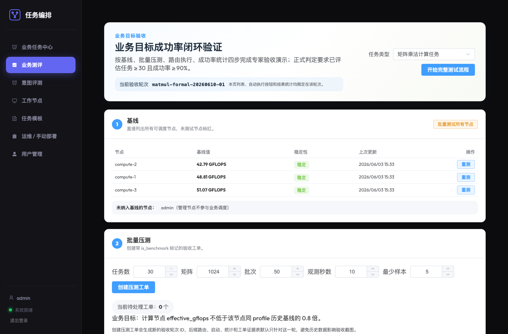
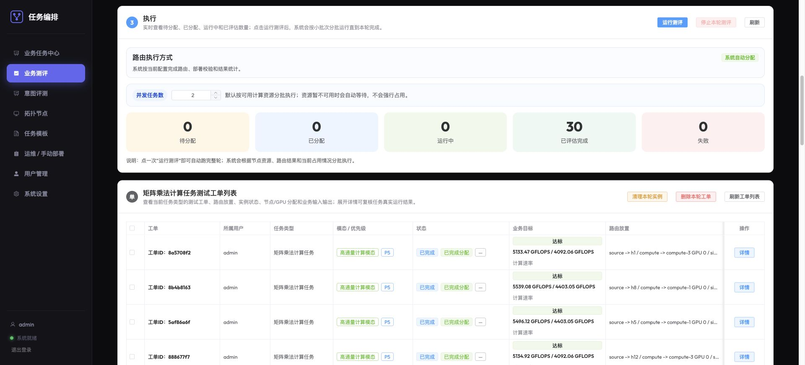
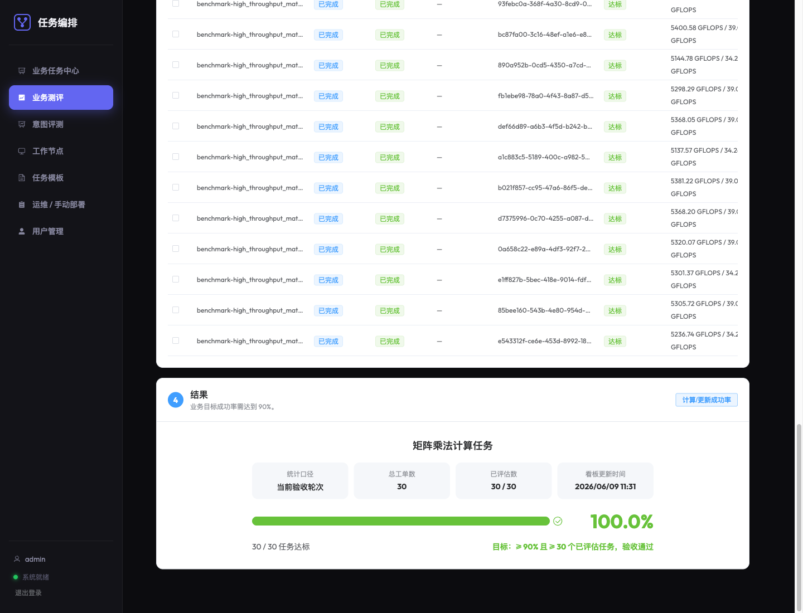
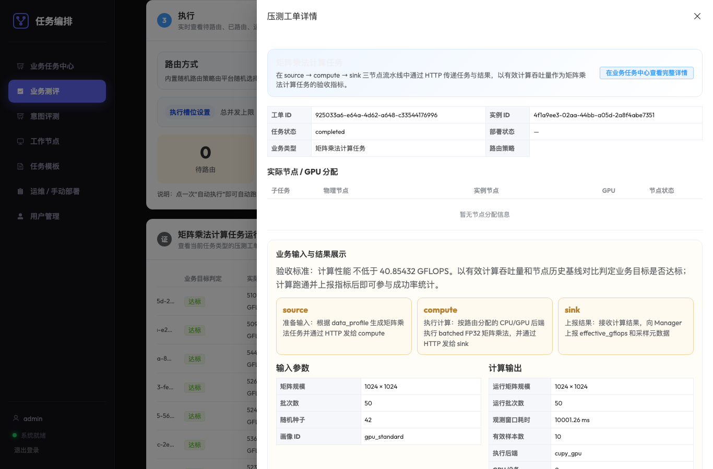
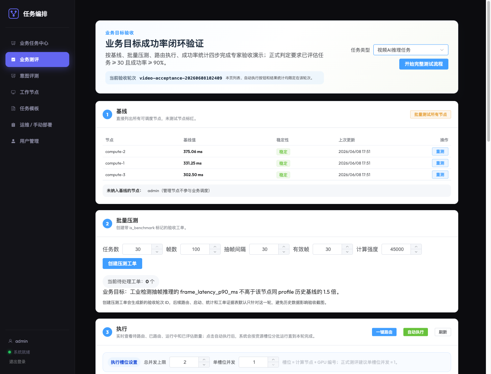
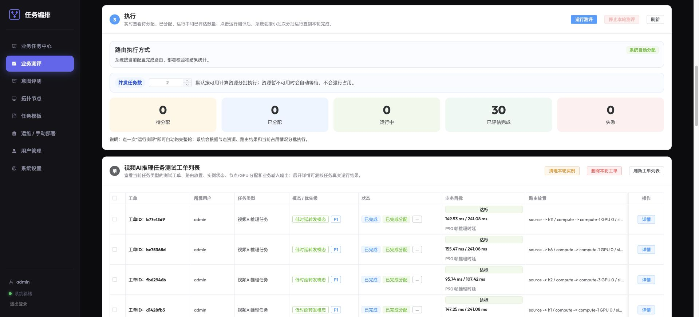
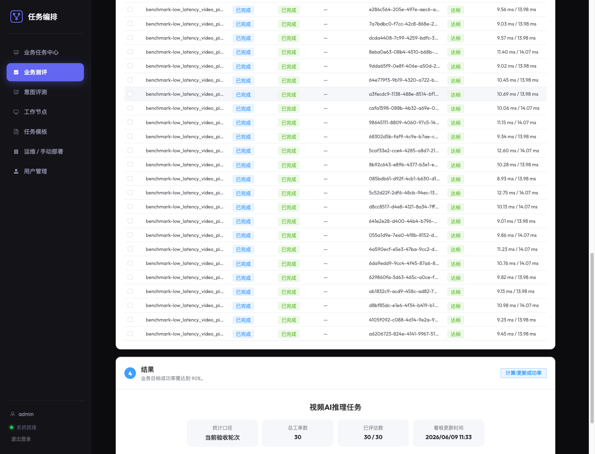
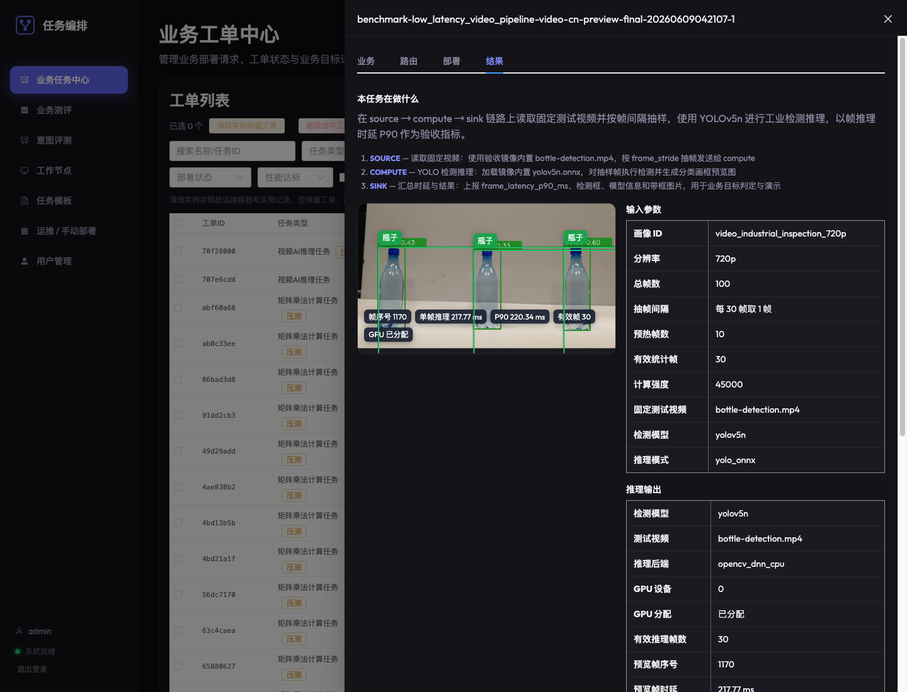
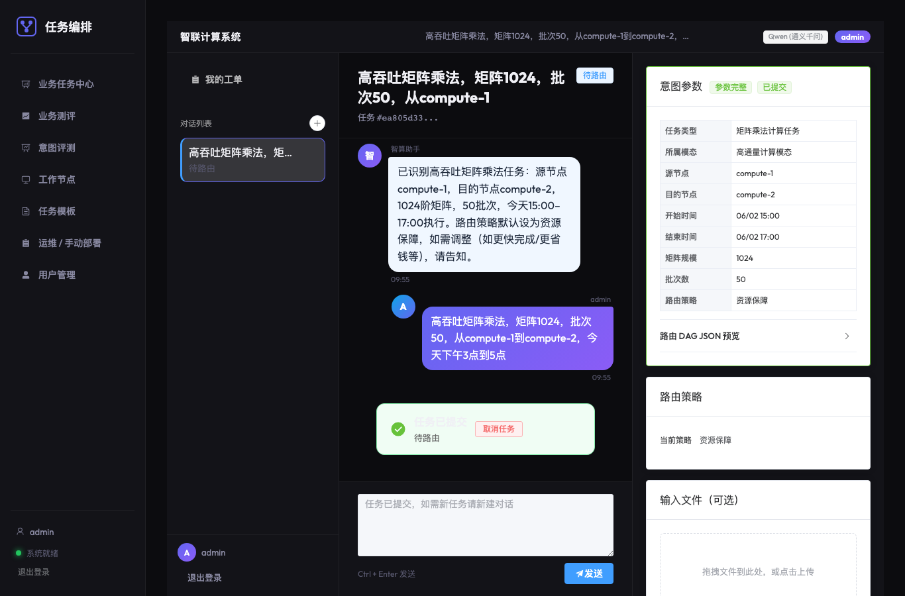
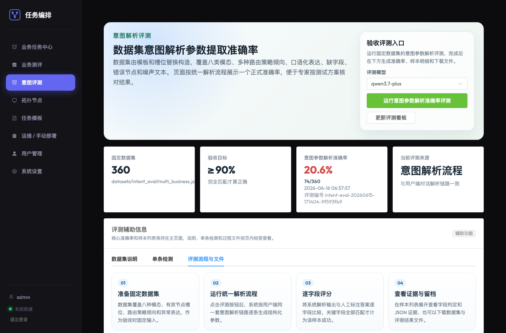

# 智联计算系统测试方案（正式修订版）

本文档为智联计算系统验收测试方案，按照旧版测试方案的用例表格格式整理，并补充当前系统已实现的意图解析评测、业务目标成功率评测和验收页面证据链展示方式。

## 0. 测试方案修订原则

1. 测试业务的输入参数可以固定。固定参数应写入前置条件和测试步骤，用于保证专家复核时可复现，不再单独设置“样本规模”行。
2. 任务运行时间由系统工单的开始时间和结束时间字段输入，不采用人工秒表计时。测试步骤中应明确单个任务的最短运行时间或最小有效采样数量。
3. 业务目标成功率不能只展示最终百分比。系统应展示每个任务的指标结果、基线值、阈值、是否达标，并展示汇总计算过程，例如达标任务数、可评价任务数和成功率公式。
4. 对过程性指标类业务，测试步骤中必须写明有效样本要求，例如矩阵计算业务输入批次数固定为 50、有效吞吐采样点不少于 5 个，视频推理有效统计帧不少于 30 帧，任务调度时间窗口不小于 5 分钟。
5. 业务目标成功率采用固定业务参数与节点历史基准值对比，运行时间仅作为任务调度输入和有效观察窗口，不直接作为人工测量指标。基准测试写入对应业务用例的前置条件和测试步骤，不单独增加测试用例数量。
6. 意图解析准确率采用固定数据集和真实大模型/智能体批量评测链路；规则解析能力仅用于开发调试和回归定位，不作为正式验收主链路。
7. 组网拓扑由总体测试方案统一给出，本子模块不写当前开发测试环境的具体机器名、IP 或节点编号。
8. 前置条件尽量采用“相关系统模块部署正常运行”“测试文件已准备”等通用表述，避免暴露过细实现细节。
9. 涉及页面操作的测试用例均预留截图位置。截图不作为测试用例表的独立字段，宜紧跟对应测试步骤穿插放置，便于专家按操作流程查看页面证据。

## 1. 测试指标定义

### 表0-1 考核指标定义

| 指标名称 | 定义 | 计算/测量方法 | 评估标准 |
|----------|------|--------------|----------|
| 用户意图解析参数提取准确率 | 针对用户自然语言业务需求，系统能够正确识别业务意图类型，并抽取出满足任务创建要求的关键业务参数。只有当意图类型正确、必填参数完整且参数值正确时，判定该样本解析成功。 | Accuracy = N_correct / N_total × 100%。N_total 为测试集样本总数；N_correct 为解析完全正确的样本数。解析完全正确需满足：意图类型正确、所属模态正确、必填参数无遗漏、参数值与标注一致、输出结构化结果符合 Schema。时间、时长、数值等字段先标准化再比对。 | 固定使用 360 条 multi-business 测试集，覆盖不同业务类型、模态、表达方式和参数组合。正式验收优先采用 Qwen 大模型/智能体批量评测链路，并与人工标注结果比对；准确率 ≥ 90% 视为达标。 |
| 业务目标成功率（通用计算） | 通用计算（矩阵乘法）业务在运行过程中，计算节点的实际有效浮点运算吞吐量满足该节点在相同业务参数下的历史基准能力要求。 | Success Rate = N_success / N_total × 100%。对单个任务：实际吞吐量 ≥ 计算节点历史基准吞吐量 × 0.8 则达标。历史基准吞吐量由同一节点、同一业务参数重复测试后取中位数得到。 | 执行不少于 30 次独立可评价任务，统计达标比例。成功率 ≥ 90% 视为满足性能要求。 |
| 业务目标成功率（视频AI推理） | 视频AI推理业务在运行过程中，推理节点的帧推理 90 分位时延满足该节点在相同视频、模型和 GPU 推理路径下的历史基准能力要求。 | Success Rate = N_success / N_total × 100%。对单个任务统一采用“业务能力保持率 ≥ 80%”判定；由于视频时延越低越好，等价为实际 90 分位时延 ≤ 节点历史基准 90 分位时延 ÷ 0.8。历史基准必须由同一节点、同一视频参数、GPU+YOLO 推理路径重复测试后取中位数得到。 | 执行不少于 30 次独立可评价任务，统计达标比例。成功率 ≥ 90% 视为满足性能要求。 |

## 2. 测试用例

### 2.1 通用计算（矩阵乘法）业务目标成功率测试

### 表1-1 通用计算业务目标成功率测试

| 项目 | 内容 |
|------|------|
| 用例编号 | 1-1 |
| 测试目的 | 验证通用计算（矩阵乘法）业务场景下的业务目标成功率，并证明系统能够展示单任务指标、计算节点基准值、达标阈值和最终成功率计算过程。 |
| 组网拓扑 | 采用总体测试方案给出的组网拓扑。本用例不单独规定具体机器名或节点编号。业务数据流采用源节点 → 业务计算节点 → 目的节点的随路计算结构。 |
| 前置条件 | 1. 按总体测试拓扑完成网络环境准备。2. 智算路由与运维相关系统模块部署正常运行。3. 参与测试的算力节点功能正常。4. 通用计算业务所需镜像或测试文件已准备完成。5. 外部路由模块工作正常，能够返回业务节点放置结果；本系统在部署前对节点和 GPU 分配冲突进行校验。6. 已对参与测试的计算节点完成矩阵计算基准测试，每个节点使用相同矩阵计算参数重复 3 次并取中位数。7. 固定业务输入为 matrix_size=1024、batch_count=50、warmup_batches=3、observation_duration_sec=10、sample_interval_sec=1、sample_batch_count=5、min_samples=5、seed=42。8. 每个测试工单均输入业务开始时间和结束时间，单任务调度时间窗口不小于 5 分钟，不采用人工秒表计时。9. 正式验收轮次固定创建 30 个工单，执行时采用小批次受控并发，同一 GPU 同一时刻最多运行 1 个验收工单，避免并发争用导致与基线口径不一致。 |
| 测试步骤 | 1. 管理员进入业务测评页面，选择“矩阵乘法计算任务”，确认当前验收轮次编号。2. 执行基线检查，确认参与测试的计算节点均有稳定基准值。3. 创建 30 个验收工单，工单中固定填入 matrix_size=1024、batch_count=50、observation_duration_sec=10、min_samples=5，并输入开始时间和结束时间，保证调度时间窗口不小于 5 分钟。4. 外部路由系统或验收自动路由流程为每个工单写回源节点、业务计算节点和目的节点放置结果；正式留档需记录路由模式和路由结果。5. 点击运行测评，系统按“每批最多任务数”和“同一 GPU 并发数”分批执行本轮已路由工单，正式测评时同一 GPU 并发数设为 1，业务数据流按源节点 → 业务计算节点 → 目的节点运行。6. 业务计算节点跳过预热阶段后持续采集吞吐样本，单轮采样计算有效浮点运算吞吐量，计算方式为 (2 × N³ × 本轮计算批次数) / 本轮耗时 / 1e9。7. 单任务实际指标取有效采样结果汇总值，并连同采样点数、运行时长、计算节点和结果文件信息上报。8. 系统按每个任务展示任务编号、计算节点、节点基准值、单任务实际指标、达标阈值和是否达标。9. 系统汇总达标任务数和可评价任务数，按“业务目标成功率 = 达标任务数 / 可评价任务数 × 100%”计算并展示。10. 展开工单详情，检查业务输入、路由结果、部署状态、指标结果和结果文件，确认业务真实运行。 |
| 预期结果 | 已完成且可评价任务数不少于 30，业务目标成功率不低于 90%，即至少 27 个任务达标；页面能够展示每个任务指标结果和成功率汇总计算过程。 |
| 测试结果 | 已按固定参数完成当前矩阵计算验收轮次 matmul-formal-20260610-01，30 个工单全部可评价且全部达标，业务目标成功率为 100.0%，满足 ≥90% 验收要求。 |

步骤 1-3 截图：矩阵乘法任务基线和固定测评参数。

步骤 8 截图：矩阵乘法任务单工单指标结果表。

步骤 9 截图：矩阵乘法任务业务目标成功率汇总，30/30 达标。

步骤 10 截图：矩阵乘法工单详情展示业务输入、路由放置、GPU 分配和计算结果。

### 2.2 视频AI推理业务目标成功率测试

### 表1-2 视频AI推理业务目标成功率测试

| 项目 | 内容 |
|------|------|
| 用例编号 | 1-2 |
| 测试目的 | 验证视频AI推理业务场景下的业务目标成功率，并证明系统能够按固定视频输入参数展示单任务帧时延指标和成功率计算过程。 |
| 组网拓扑 | 采用总体测试方案给出的组网拓扑。本用例不单独规定具体机器名或节点编号。业务数据流采用源节点 → 视频推理节点 → 目的节点结构。 |
| 前置条件 | 1. 按总体测试拓扑完成网络环境准备。2. 智算路由与运维相关系统模块部署正常运行。3. 参与测试的算力节点功能正常。4. 视频AI推理业务所需镜像已准备完成，镜像内置固定测试视频、YOLO 检测权重和类别标签文件。5. 外部路由模块工作正常，能够返回业务节点放置结果，并为视频推理节点分配 GPU 设备号；本系统在部署前校验同一 GPU 不被重复占用。6. 已对参与测试的计算节点完成视频推理基准测试，每个节点使用相同视频参数和 GPU+YOLO 推理路径重复 3 次并取中位数；仅开发调试路径产生的 CPU 或模拟推理结果不得作为正式基线。7. 固定输入参数包括 video_asset=bottle-detection.mp4、model_name=yolov5n、inference_mode=yolo_onnx、resolution=720p、fps=30、frame_count=100、frame_stride=30、warmup_frames=10、measured_frames=30、max_detections=8。8. 每个测试工单输入业务开始时间和结束时间，单任务调度时间窗口不小于 5 分钟。9. 单任务有效统计帧不少于 30 帧；不足 30 帧的任务不作为达标样本，应补测。 |
| 测试步骤 | 1. 管理员在业务测评页面选择“视频AI推理任务”，确认当前验收轮次编号。2. 执行或确认基线检查，确认参与测试的计算节点均有当前视频输入参数对应的稳定基准时延。3. 创建 30 个验收工单，固定填入视频输入参数和业务开始/结束时间。4. 外部路由系统或验收自动路由流程写回源节点、视频推理节点和目的节点放置结果，视频推理节点携带 GPU 分配信息；部署系统同步校验 GPU 冲突。5. 点击运行测评，系统按“每批最多任务数”和“同一 GPU 并发数”分批执行本轮已路由工单，正式测评时同一 GPU 并发数设为 1。6. 源节点读取镜像内置固定测试视频，并按 frame_stride 抽帧发送给视频推理节点。7. 视频推理节点加载固定 YOLO 权重，跳过 warmup_frames 后统计 measured_frames 的逐帧推理时延，并生成分类检测框。8. 单任务计算帧推理时延 90 分位值，并上报有效帧数、90 分位时延、模型信息、检测结果和带框预览图。9. 系统按每个任务展示任务编号、视频推理节点、GPU 编号、节点基准时延、单任务实际 90 分位时延、达标阈值和是否达标。10. 系统汇总达标任务数和可评价任务数，按“业务目标成功率 = 达标任务数 / 可评价任务数 × 100%”计算并展示。11. 展开视频业务工单详情，检查业务输入、提交给路由系统的 DAG JSON、路由结果、GPU 分配、部署状态、指标结果、检测类别、画框坐标和带框预览图。 |
| 预期结果 | 已完成且可评价任务数不少于 30，视频AI推理业务目标成功率不低于 90%；页面能够展示单任务帧推理时延、GPU 分配、分类检测结果、带框预览图和汇总成功率计算过程。 |
| 测试结果 | 已按固定参数完成当前视频AI推理验收轮次 video-formal-20260610-01，30 个工单全部可评价且全部达标，业务目标成功率为 100.0%，满足 ≥90% 验收要求；工单详情可展示 YOLO 检测框、中文类别标签、GPU 分配和帧时延元数据，用于演示业务真实执行结果。 |

步骤 1-3 截图：视频AI推理任务基线和固定测评参数。

步骤 9 截图：视频AI推理任务单工单帧时延结果表。

步骤 10 截图：视频AI推理任务业务目标成功率汇总，30/30 达标。

步骤 11 截图：视频AI推理工单详情展示 YOLO 分类画框、中文标签、GPU 分配和时延结果。

### 2.3 智算意图驱动路由意图解析功能测试

### 表2-1 用户意图解析系统功能测试用例

| 项目 | 内容 |
|------|------|
| 用例编号 | 2-1 |
| 测试目的 | 验证用户通过对话输入业务需求后，系统能够识别业务类型、提取关键参数、提示缺失参数，并生成可提交给路由系统的结构化任务需求。 |
| 前置条件 | 1. 智能体对话相关系统模块部署正常运行。2. 用户已登录意图对话页面。3. 系统已配置智能体解析能力。4. 系统中已维护测试所需的源终端、目的终端和业务节点名称。 |
| 测试步骤 | 1. 浏览器打开意图对话页面。2. 输入固定测试文本：“我想部署视频AI推理业务，用 yolo 模型，源终端A，目的终端B，分辨率 720p，30fps，现在开始运行 10 分钟”。3. 点击发送消息，等待系统返回解析结果。4. 查看页面返回内容，确认页面能展示解析出的业务类型、所属模态、源终端、目的终端、开始时间、结束时间和业务参数。5. 输入固定缺失参数测试文本：“我想做矩阵乘法任务，目的终端B，1024 阶矩阵，50 批，现在开始运行 10 分钟”。6. 点击发送消息，等待系统返回解析结果或缺失参数提示。 |
| 预期结果 | 系统能正常返回生成解析结果即可。 |
| 测试结果 | 当前系统已实现意图对话、参数草稿、确认提交、工单生成和路由请求记录；正式验收时保存对话页面、结构化参数和工单详情截图。 |

步骤 1-4 截图：用户对话提交业务需求后，页面展示结构化意图参数和路由 DAG JSON 入口。

### 2.4 用户意图解析参数提取准确率测试

### 表2-2 用户意图解析参数提取准确率测试

| 项目 | 内容 |
|------|------|
| 用例编号 | 2-2 |
| 测试目的 | 验证用户意图解析参数提取准确率是否达到 90% 验收要求。 |
| 前置条件 | 1. 管理后台相关系统模块部署正常运行。2. 管理员账号可以正常登录管理后台。3. 意图评测页面可以正常访问。4. 系统已配置可用于评测的 Qwen 智能体模型。5. 已准备固定测试数据集，数据集由多条自然语言业务需求文本和人工标注结果组成，覆盖不同业务类型、模态、完整输入、缺失参数和错误参数等常见情况。6. 测试过程中不临时新增或替换数据集，保证前后评测口径一致。 |
| 测试步骤 | 1. 浏览器打开管理后台登录页面，使用管理员账号登录。2. 在左侧菜单进入“意图评测”页面。3. 查看页面顶部统计卡，确认固定数据集总数为 360，验收目标为不低于 90%。4. 在“验收评测入口”选择 Qwen 评测模型。5. 点击“运行智能体/大模型意图解析评测”，系统按固定数据集执行批量评测。6. 在评测进度区域查看任务状态，等待评测完成；如页面提供同步按钮，则点击同步评测进度。7. 评测完成后查看页面统计卡，记录总样本数、正确样本数、准确率和评测编号。8. 查看“按样本类型准确率”和“评测样本”列表，抽查成功样本和失败样本；展开单条样本，查看用户输入文本、所属模态、解析结果、期望结果和字段判定。9. 点击页面下载按钮，保存原始数据集、评测结果和评测留档文件。10. 根据页面展示结果计算参数提取准确率，计算公式为 Accuracy = N_correct / N_total × 100%。 |
| 预期结果 | 参数提取准确率不低于 90%，并能展示每个样本的所属模态、解析结果和最终准确率计算过程。 |
| 测试结果 | 已使用 qwen3.7-plus 对扩展后的 360 条固定数据集完成大模型/智能体批量评测，正确 348 条，准确率 96.7%，达到 ≥90% 验收目标；评测编号为 intent-eval-20260608-174844-8ca41b57。失败样本主要集中在“尽量少占资源”等路由策略同义表达被判为负载均衡，系统页面可展示失败样本和字段判定。 |

步骤 3-7 截图：意图评测页面展示固定数据集规模、模型评测入口、评测编号和准确率结果。

步骤 8-9 截图：评测样本列表支持查看输入、解析结果、期望结果和字段判定。

### 2.5 意图解析评测自动化实现

1. 固定数据集由多条自然语言业务需求文本和对应人工标注结果组成，不在验收页面开放数据集选择，避免验收口径漂移。
2. 数据集内容覆盖多种业务类型和常见表达方式，包含完整输入、缺失参数和错误参数等场景；正式测试方案中仅做概括说明。
3. 评测优先使用大模型/智能体批量评测链路。规则解析仅作为开发调试开关下的回归定位工具，不纳入正式验收主链路。
4. 管理员后台意图评测页面展示固定数据集总数、开发调试评测、大模型评测、评测状态、按样本类型准确率、成功/失败样本明细和单条解析检测。
5. 每次正式大模型评测有独立 evaluation_id、job_id、提交时间、输入文件、输出文件和报告文件。
6. 评测留档文件包括原始数据集、大模型/智能体评测结果、评测任务状态、评测输入文件和评测输出文件；如需保留开发调试评测结果，应单独标注“仅开发调试”。
