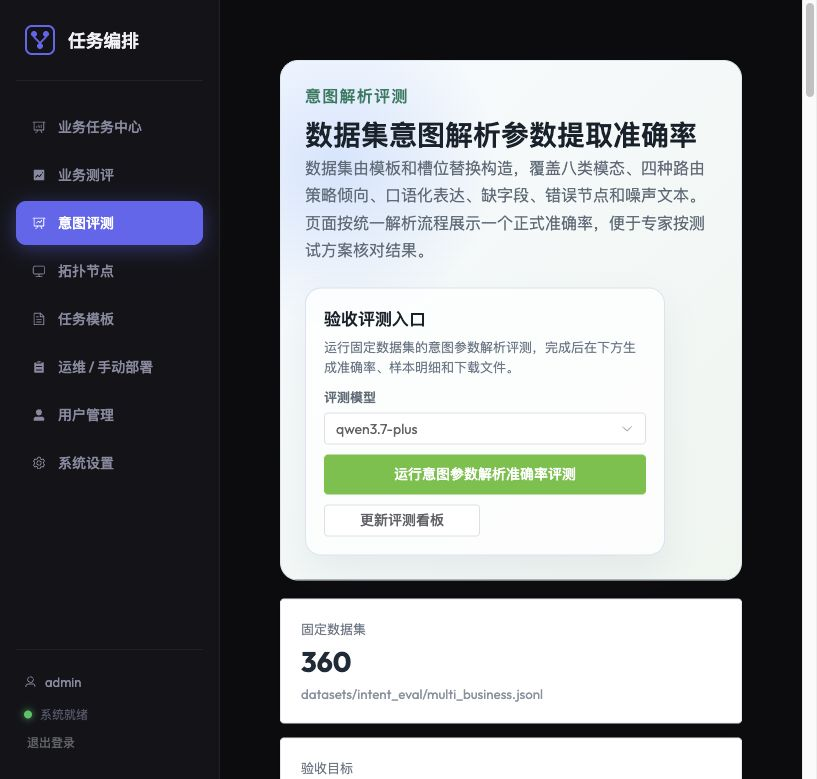
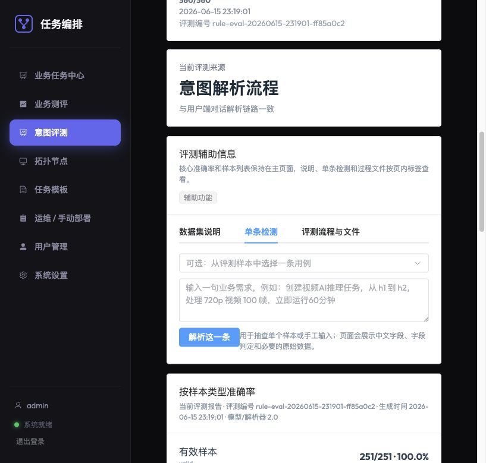
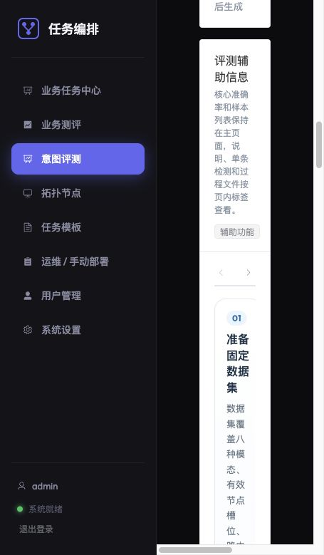
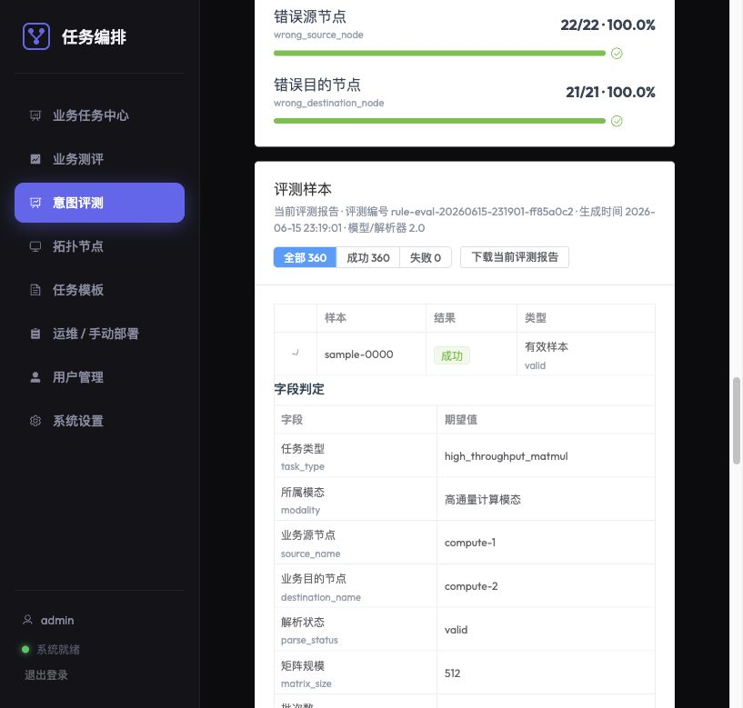
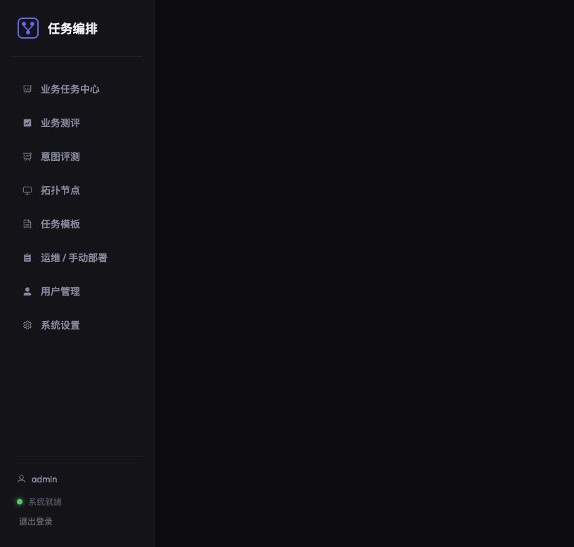
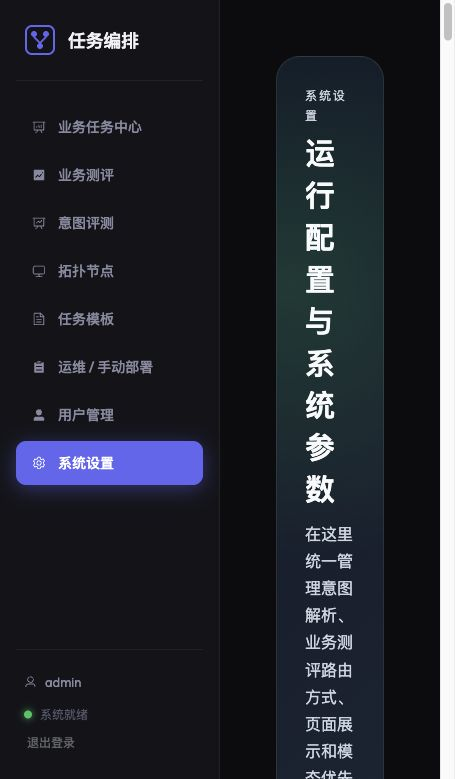

# 智联计算系统使用说明书

本文档面向系统操作、测评和日常维护，说明系统主要页面的用途、推荐操作流程和截图位置。当前版本重点覆盖意图解析评测、拓扑节点管理、业务任务与业务测评流程。

## 1. 登录与页面入口

1. 打开管理端地址，例如 `http://10.112.244.94:8182/login`。
2. 使用管理员账号登录后，左侧菜单可进入业务任务中心、业务测评、意图评测、拓扑节点、任务模板、运维 / 手动部署、用户管理和系统设置。
3. 普通用户侧重点使用意图对话入口提交自然语言业务需求；管理员侧重点查看工单、评测结果和拓扑节点状态。

## 2. 意图解析评测

意图评测页面用于验证“数据集意图解析参数提取准确率”。页面核心内容包括固定数据集规模、验收目标、当前准确率和评测样本列表；辅助说明、单条检测和文件下载通过页内标签切换查看，避免所有信息堆在同一屏。

### 2.1 数据集说明

“数据集说明”标签展示固定数据集的构成逻辑、节点槽位、八种模态示例、样本类型覆盖和模态覆盖。这里用于向专家解释数据集覆盖面，不需要展开每条样本的完整 JSON。

### 2.2 单条检测

“单条检测”标签用于抽查某一条样本或手工输入一句业务需求。操作时可以从下拉框选择样本，也可以直接输入自然语言，点击“解析这一条”查看中文字段、字段判定和必要的原始 JSON。

### 2.3 评测流程与文件

“评测流程与文件”标签说明固定数据集评测的四步流程：准备数据集、运行解析流程、逐字段评分、查看证据与留档。这里也提供原始数据集、评测结果和过程文件下载入口。

如果大模型批量评测长时间显示“评测中”，但请求计数一直是“完成 0、失败 0”，说明平台刷新接口已经能正常查询官方任务，只是官方批处理任务仍停留在队列或挂起状态。此时建议先点击“同步评测进度”确认状态；若超过 2 小时仍无进展，可取消当前评测后重新提交，必要时先用已验证模型做小样本 smoke，再跑完整 360 条数据集。

### 2.4 样本详情证据

在评测样本列表中展开某条样本，可以看到字段判定和评测证据说明。页面将 JSON 拆成四类，便于理解：

- 样本定义 JSON：数据集中预先准备的自然语言输入和人工标注答案。
- 系统解析输出 JSON：本次评测实际提取出的任务类型、节点、模态和业务参数。
- 人工标注答案 JSON：评分基准。
- 原始响应 JSON：用于技术排障；仅在存在原始返回内容时展示。

## 3. 拓扑节点管理

拓扑节点页面用于维护系统可用节点。当前页面主要展示管理节点、终端节点和计算节点；交换机、存储、路由设备等基础设施节点暂不在页面展示。

节点卡片按更符合人类阅读的自然顺序排列，例如 `h1, h2, h3 ... h13`，再到计算节点。卡片中可查看管理 IP、业务 IP、Agent 地址、GPU、CPU、内存和 CUDA/驱动信息。

## 4. 业务任务中心

业务任务中心用于查看用户提交的任务工单。建议操作时重点查看：

- 工单来自用户自然语言意图解析后的确认提交。
- 工单详情展示任务参数、源/目的节点、部署状态、路由结果、业务面 IP 和端口、输入数据与结果证据。
- 已完成或已停止的工单只要未删除，仍可查看历史输入、输出和评估结果。

## 5. 业务测评

业务测评页面用于运行固定业务目标成功率测试。当前建议重点查看两类业务：

- 矩阵乘法计算任务：展示矩阵规模、运行结果数值、业务目标指标和是否达标。
- 视频 AI 推理任务：展示输入视频、抽帧推理结果、中文分类标签、画框结果和推理时延。

业务测评列表本质是测试工单列表。管理员可以查看每条测试工单的运行状态、业务目标数值、是否达标和任务工单详情。成功率应以当前评测轮次的已评估工单为口径计算。

## 6. 系统设置

系统设置用于集中维护解析、路由、展示和优先级相关配置。常见配置包括：

- 意图解析使用主解析流程或系统解析流程。
- 业务测评使用系统自动分配，或等待外部路由系统回写节点和 GPU 分配结果；正式外部路由联调时应选择“外部路由系统”，系统自动分配主要用于平台闭环调试。
- 是否展示路由 DAG JSON 等偏技术调试信息。
- 八种模态到路由优先级的映射。
- 任务类型到业务模态的映射，以及任务资源要求覆盖。默认使用系统估算，只有管理员确认需要调整时才启用覆盖。

日常操作时建议关闭不必要的调试 JSON 展示，仅保留能说明业务真实运行和测评结果的内容。

路由策略和业务模态是两类配置：路由策略表示本次选路偏好，例如“低时延转发”或“资源预留保障”；业务模态表示任务所属业务流类型，例如“低时延转发模态”或“高通量计算模态”。系统会根据模态映射出 1-8 的业务优先级，并写入 DAG，供路由系统做 QoS 或路径等级参考。二者不是同一维度，例如高通量计算模态的任务也可以在特定场景下选择低时延转发策略。

## 7. 推荐操作流程

1. 登录管理端，确认系统状态正常。
2. 进入拓扑节点页，说明可用终端节点和计算节点。
3. 进入意图评测页，展示固定数据集说明，运行或查看最新意图参数解析准确率。
4. 展开一条样本，说明字段判定和证据 JSON 的含义。
5. 进入用户端意图对话，提交矩阵乘法或视频 AI 推理任务。
6. 在业务任务中心查看工单详情，确认路由结果、部署状态、业务输入和结果证据。
7. 在业务测评页运行固定测试轮次，查看每条测试工单和最终业务目标成功率。

## 8. 运维注意事项

- 测试前建议清理旧的历史测试数据和孤儿容器，避免旧数据影响当前截图和成功率统计。
- 拓扑扩展后，应先在拓扑节点页面确认节点别名、真实主机 ID、管理 IP、业务 IP、Agent 地址和资源属性。
- 与外部路由系统联调时，跨系统只使用统一工单 ID / 路由订单 ID / DAG `job_id`，便于排查。
- DAG 中的 CPU、内存、磁盘、GPU 和带宽需求由平台确定性生成；管理员可在系统设置中覆盖任务资源要求，便于按历史基线或实测结果校准。其中 GPU 会进入实际 Docker 设备分配；CPU、内存和磁盘当前主要用于路由估算、展示和容器环境变量，不自动作为容器硬限制。
- 如果网络刚建立完成，业务容器应支持等待 `network-ready` 和业务请求重试，避免路由流表尚未生效时误判失败。

## 9. 截图资产清单

当前文档中使用的截图位于 `docs/images/`，可复用到测试方案或汇报材料：

| 截图文件 | 用途 |
|----------|------|
| `usage-intent-evaluation-overview.jpg` | 意图评测总览和准确率展示 |
| `usage-intent-evaluation-helper.jpg` | 数据集说明和八种模态示例 |
| `usage-intent-evaluation-single.jpg` | 单条样本解析检查 |
| `usage-intent-evaluation-process.jpg` | 评测流程与批量评测进度 |
| `usage-intent-evaluation-sample-detail.jpg` | 样本展开后的字段判定证据 |
| `usage-topology-nodes.jpg` | 拓扑节点卡片、资源属性和节点别名 |
| `usage-system-settings.jpg` | 系统设置、模态优先级和任务资源要求 |
